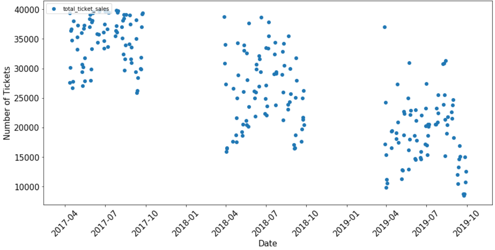

# Data PreProcessing

## Assumptions

* In ticket_scans.csv, N/A entries removed from the scope of this project.
* In ticket_scans.csv, there were some duplicate rows (i.e. the same ticket was scanned multiple times for a given date). Duplicates were removed from the scope of this project.
* ticket_scans were merged with ticket_sales on game_date, section, row, seat. There were just under 105,000 ticket scans that could not be matched to a ticket sale and were removed the scope of this project.

## Feature Engineering

* purchased_on_win_streak: streak was calculated. Allotted a 1 if a purchase_date was on a date where the team was on a streak.
* day_night_code: whether a game was held during the day (12:37, 13:07), afternoon (15:07, 16:07, 15:37), or evening (19:07).
* holiday: whether a game was held on a holiday.
* giveaway_item: whether a game had a give away item.
* event: whether a game invovled an event.
*14_day_buyer: whether a ticket was purchased 14 days prior to the game.
*30_day_buyer: whether a ticket was purchased 30 days prior to the game.
section: what section a ticket pertains to (100, 200, 500 level).
series_nbr_bins: whether the game falls into beginning, beginning-middle, middle, middle-end, or end of season.
game_date_dow: the day of the week of a game.

## Data Exploration

Some basic data exploration was performed to observe high level trends. The following trends were observed:
* Ticket sales are decreasing from 2017 to 2018 to 2019.
* Proportion of tickets scanned against tickets purchased has remained relatively the same from 2017, 2018, 2019.
* 100 level section seats have seen the biggest decrease in sales from 2017, 2018, to 2019.
* Season tickets purchased exhibited the greatest decrease in sales from 2017, 2018, 2019 than any other ticket_type.
* All 3 seasons (2017, 2018, 2019) have a high number of ticket sales in the middle of season.
* A vast majority of tickets are purchased within 30 days of game day.

##### Total tickets purchased vs. game_date

##### Total tickets purchased and scanned by year

##### Number of tickets purchased by section by game_date

##### Number of tickets purchased by ticket_type by game_date

##### Number of tickets purchased by month seperated by season (2017, 2018, 2019)

##### Number of tickets purchased (across 2017, 2018, 2019) against purchase date delta (number of days between purchase date and game date)

