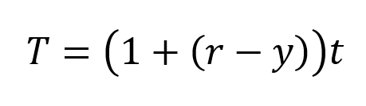
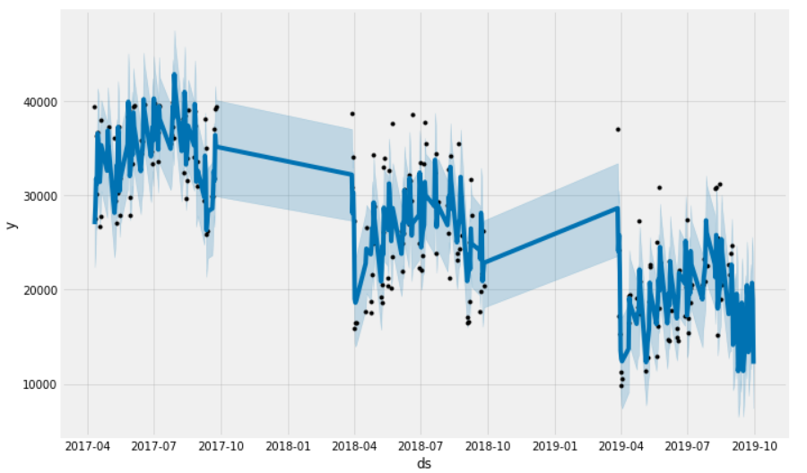
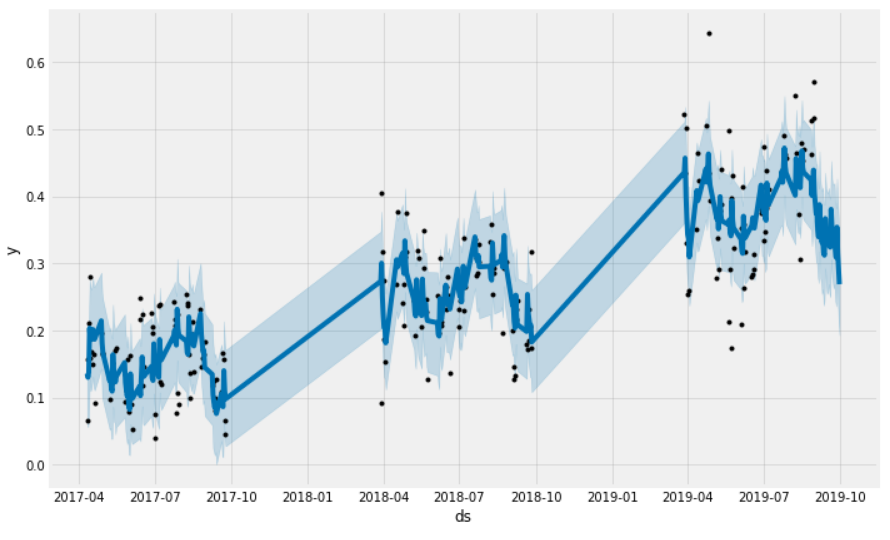
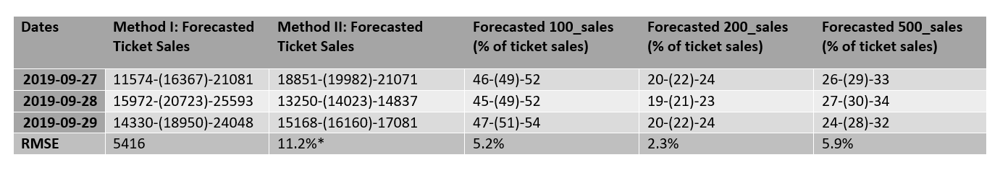
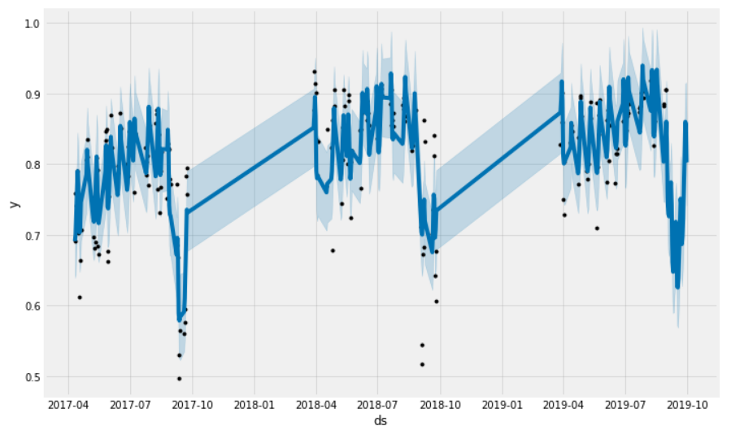

# Ticket Sale Forecast and Turnstile Forecast

## Background

I used a python library called FB-Prophet to do all time-series forecasting for this project. FB Prophet is a procedure for forecasting time series data based on an additive model where non-linear trends are fit with yearly and weekly seasonality. It works best with time series that have strong seasonal effects and several seasons of historical data. Prophet is robust to missing data and shifts in the trend, and typically handles outliers well.

## (A) Forecasting Ticket Sales

### Methodology

I used 2 different ways to forecast ticket sales:

Method I:
 Fit number of tickets purchased against game_date for 2017, 2018, 2019 seasons.

Method II:
 The dataset ends at tickets purchased as of 08/31/2019; that includes tickets purchased for future games, more specifically, the subject games on 09/27/2019, 09/28/2019, and 09/29/2019. And I know that many customers purchase their tickets within 30 days of the game. So I can breakdown total tickets purchased for a given game as (tickets purchased within 30 days of the game) + (tickets purchased prior to 30 days of the game). For the subject games, I already have the number of tickets purchased up to 08/31/2019 and I know what portion of those ticket sales were within 30 days prior to the game. All I need to to do is forecast the remaining number of tickets purchased within 30 days of the game and add it to the current ticket sales. And I do that by forecasting the ratio of tickets purchased 30 days prior / total tickets purchased. To get an actual number of tickets for the subject games, I apply the following formula:

* T=total tickets purchased
* r=forecasted ratio of tickets purchased 30 days prior to game against total tickets purchased.
* y=ratio of tickets purchased 30 days prior to number of tickets purchased as of 08/31/2019 for subject game
* t=number of tickets purchased as of 08/31/2019 for subject game

### Forecast

The figures below are the forecasts using Method I and Method II as described above. The blue lines are the predictions, the black dots are actuals, and the shaded gray regions encompass lower and upper bounds.

Method I: shows a forecasted decrease in ticket sales

Method II: shows a forecasted increase in the portion of tickets purchased within 30 days prior of a game

### Results

The following table summarizes the results:

(*) denotes RMSE pertains to the percent of total tickets purchased within 30 days prior of a game.

## (B) Forecasting Turnstile

### Methodology

Ticket scans were forecasted as a percent of ticket purchases. To determine the distribution of ticket scans by ticket_type (game_pack, group, season_ticket, single_game), the percent of ticket scans by each ticket type was forecasted.

### Forecast

The percent of tickets scanned followed the same trend every year, where the end of the season shows a decrease.

### Results

The following table summarizes the results:

(*) denotes RMSE pertains to the percent of total tickets purchased within 30 days prior of a game.

