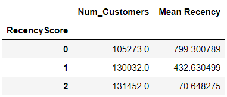
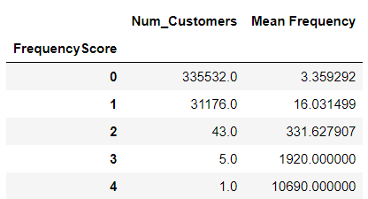
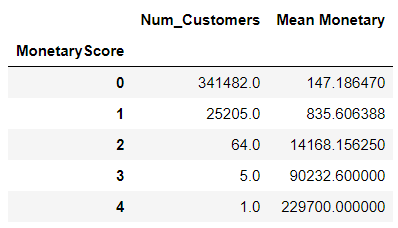
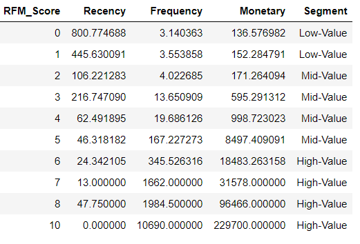

# Customer Clustering of Single Game Ticket Buyers

## Methodology

I used the KMeans clustering algorithim from Python SciKitLearn library. It is a simple unsupervised machine learning algorithim. It basically clusters data around a certain number of centroids (k) of the data.

I performed 2 types of clustering: (1) RFM (Recency-Frequency-Monetary), and (2) Behavioral. By the end of the clustering script, every acct_id (customer) was labeled with an RFM Overall score and a Behavioral Cluster Label (acct_id's with the same Behavioral label can be considered to exhibit the same behavior in terms of the features selected).

### RFM (Recency, Frequency, Monetary)

* Recency: Date difference (in number of days) between last game_date in dataset (08/31/2019) and the last game a customer attended (i.e. ticket was scanned). If a customer purchased a ticket but never attended a game, they were given a last_game_attended date of 04/10/2017 (day before earliest game_date in dataset to ensure the worst Recency score).

* Frequency: The number of tickets purchased by a given customer.

* Monetary: The amount of money spent by each customer based on number of 100, 200, 500 level tickets purchased by a given customer. The following prices were assumed for ticket prices:
** 500 level: 19 CAD
** 200 level: 43 CAD
** 100 level: 65 CAD

Customers were clustered around Recency, Frequency, Monetary individually (1D clustering requires no standarization or scaling) against the following number of clusters (k), respectively, after determining a value of k by plotting a scree plot:

#### Recency k: 3 (Scores of 0, 1, 2)
 

#### Frequency k: 5 (Scores of 0, 1, 2, 3, 4)
 

#### Monetary k: 5 (Scores of 0, 1, 2, 3, 4)
 

* Overall RFM_Score was calculated for each customer by summing scores for Recency, Frequency, and Monetary.

 

As you can see from the table above, customer can be more vaguely clustered as Low-Value, Mid-Value, and High-Value based on Overall Score.

* Low Value: Customers who are less active than others, not very frequent /visitor and generates very low revenue.

* Mid Value: In the middle of everything. Often using platform (but not as much as our High Values), fairly frequent and generates moderate revenue.

* High Value: The group we don’t want to lose. High Revenue, Frequency and low Inactivity.

### Behavioral Clustering

Every customer was also clustered (given a behavioral label between 0, 1, 2, 3 (k=4)) based on the following features. Because, clustering is being performed across severall dimensions, features were standardized to account for variance. 
* holiday
* give-away item
* event
* purchased ticket on win streak
* purchased ticket within 14 days of game
* purchased ticket within 30 days of game
* seating section (100, 200, 500)
* game time (day, afternoon, evening)
* beg-mid-end of season
* day of the week
* game attendance (ticket scanned)

### RFM vs. Behavioral

Interestingly enough, there were only 44 high-value RFM Customers. More importantly, low-value RFM customers (219868 customers) and mid-value RFM customers (1456845 customers) were compared across the behavioral features explained above. 

There were no significant differences between low-value RFM and mid-value RFM customers in terms of the behavioral features investigated (refer to Scripts/Customer_Clustering.ipynb for figures). 

